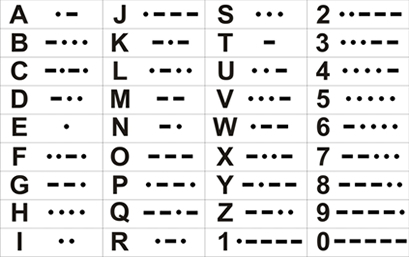

# MorseCode

O Código Morse é um sistema de representação de letras, números e símbolos utilizando sons curtos e longos. Cada um dos caracteres são representados por uma combinação específica de pontos e traços, como o exemplo apresentado na tabela abaixo:

Um monitor teve a ideia de usar uma BST para representar os caracteres descritos na tabela acima, pontos para a esquerda e traços para a direita, e resolveu criar um programa que continha as seguintes funções:

- __INSERIR: Char Cod__; Insere um caracter __Char__ e seu respectivo código __Cod__ na árvore.
- __REMOVER: Cod__; Remove o caracter referente ao código __Cod__ da árvore se ele existir, caso contrário imprime "__Codigo Invalido__".
- __BUSCAR: Cod__; Imprime o caractere referente ao código __Cod__ da árvore se ele existir, caso contrário imprime "__Codigo Invalido__".
- __DECODIFICAR: Cod1 Cod2 ... CodN__: Imprime a palavra formada pela decodificação dos códigos __Cod1..CodN__ se for possível decodificar todos, caso contrário imprime "__Codigo Invalido: CodX__", onde __CodX__ é o primeiro código não decodificável
- __FIM__; Finaliza o programa.

Sua tarefa será implementar uma Árvore de Busca Binária para armazenar os caracteres e seus respectivos códigos em ponto e traço, e retornar os resultados esperados para os comandos descritos acima.

## Input

- __Comando 1__
- __Comando 2__
- __...__
- __Comando N__

## Output

- Após o comando __INSERIR__, imprimir: "__Caractere inserido com sucesso__" caso não haja um caractere com o mesmo código na árvore, caso contrário: "__Codigo ja utilizado__"
- Após o comando __REMOVER__, imprimir: "__Caractere removido com sucesso__", caso o caractere exista na árvore, caso contrário: "__Codigo Invalido__" 
- Após o comando __BUSCAR__, imprimir: "__Char__", onde Char é o caracter referente ao código caso o caractere exista na árvore, caso contrário: "__Codigo Invalido__" 
- Após o comando __DECODIFICAR__, imprimir a palavra formada pela decodificação do código caso possível, caso contrário: "__Codigo Invalido: *CodX*__", onde __CodX__ é o primeiro código não decodificável

---
## Sample Input
- __INSERIR: B -...__
- __INSERIR: T -__
- __INSERIR: S ...__
- __INSERIR: A .-__
- __BUSCAR: .-__
- __REMOVER: .-__
- __BUSCAR: .-__
- __DECODIFICAR: -... ... -__
- __DECODIFICAR: -... .- -__
- __FIM__

## Sample Output
- __Caractere inserido com sucesso__
- __Caractere inserido com sucesso__
- __Caractere inserido com sucesso__
- __Caractere inserido com sucesso__
- __A__
- __Caractere removido com sucesso__
- __Codigo Invalido__
- __BST__
- __Codigo Invalido: .-__
